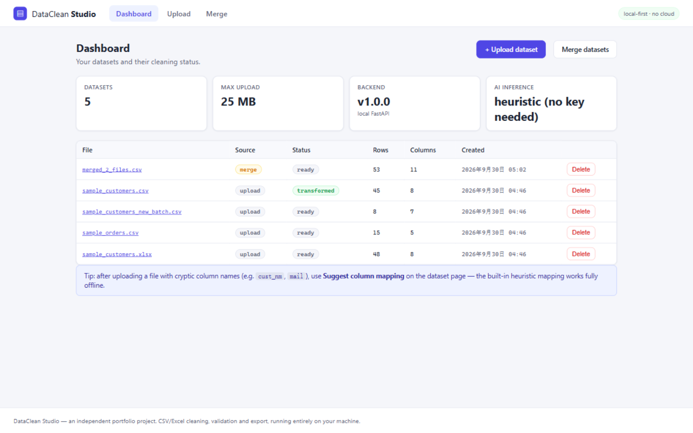
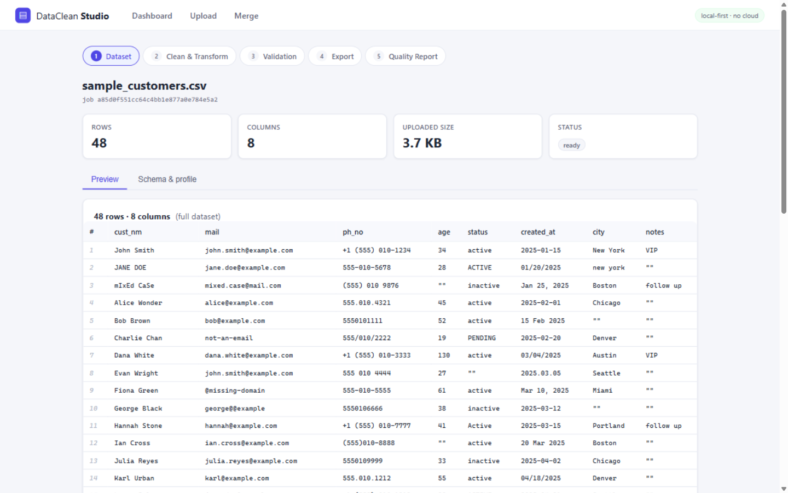
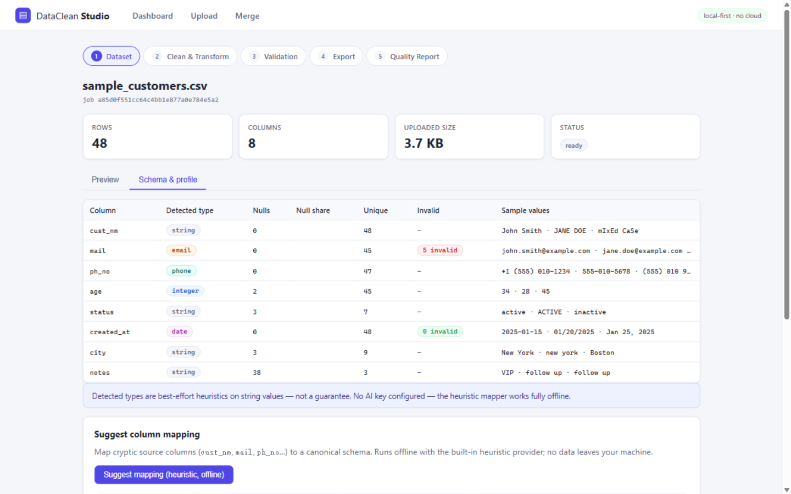
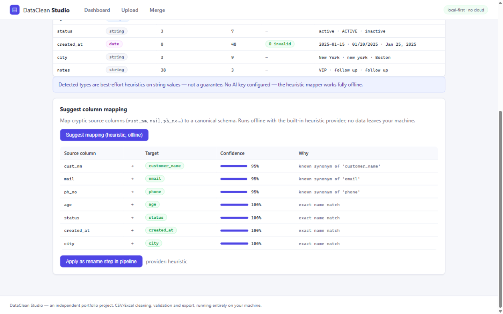
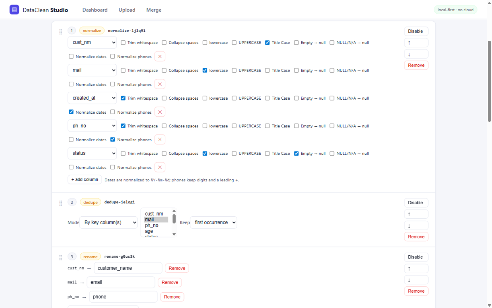
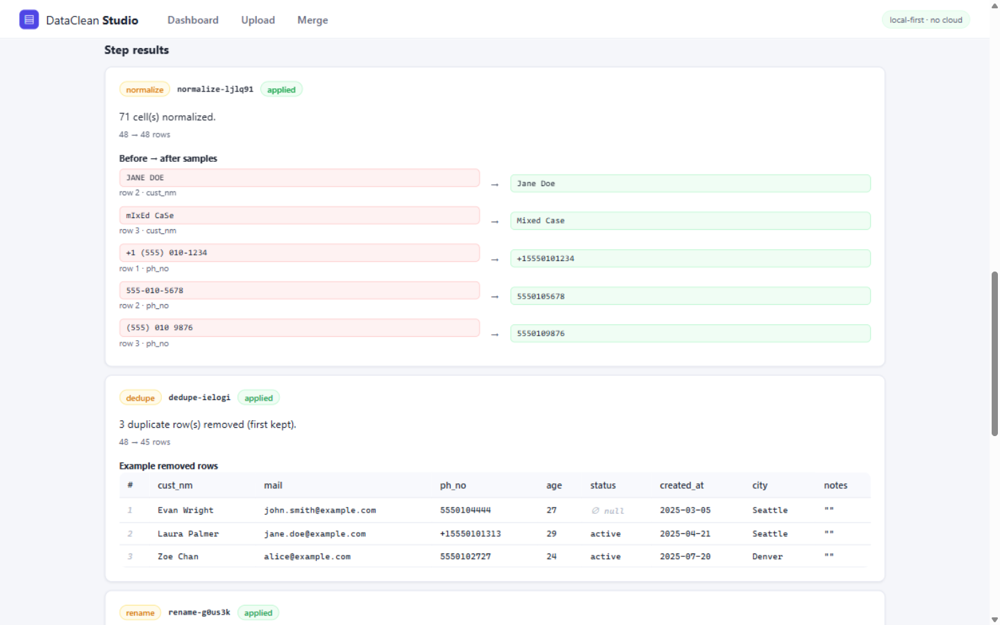
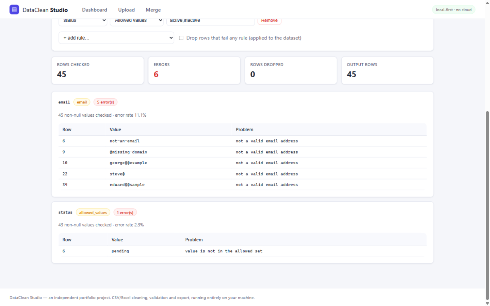
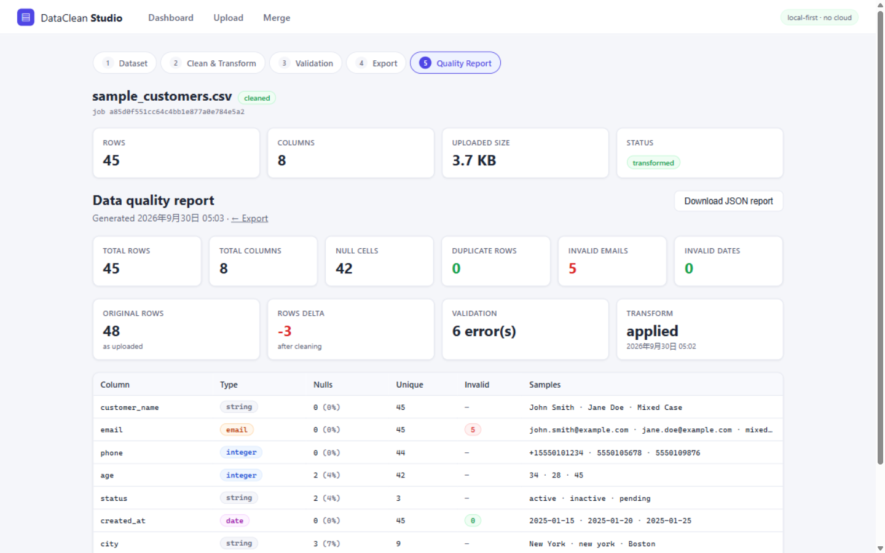

# DataClean Studio

A local-first web tool for cleaning, validating and transforming **CSV / Excel** data — upload a file, profile it, build a cleaning pipeline, and export clean CSV / JSON / XLSX with a full data-quality report.

**Independent portfolio project.** All data is processed locally by a backend you run yourself; nothing leaves your machine. The demo requires no API keys.



## Features

- **Upload** — drag & drop or file picker for `.csv`, `.xlsx`, `.xls`; size limits, extension/content sniffing (client MIME types are never trusted), safe stored filenames
- **Schema detection** — per-column best-effort type inference (integer, float, boolean, date, datetime, email, phone, string), null counts, unique counts, sample values, invalid-value counts
- **Preview** — first 50 rows of the dataset at any processing stage
- **Validation rules** — required, email, numeric range, string length, date parsing, regex (full-match), allowed values; with per-rule error samples, error rates, and optional "drop invalid rows"
- **Normalization** — trim, collapse spaces, case folding (lower/upper/title), empty→null, `NULL/N/A/none`→null, date normalization to a uniform format (mixed input formats supported, `day_first` option), phone normalization (strips separators, keeps digits and a leading `+`)
- **Duplicate detection** — exact-row duplicates or key-column duplicates, keep first/last, with example removed rows
- **Column mapping** — rename / drop / reorder columns, with a preview
- **Merge** — stack multiple uploaded datasets vertically: union (missing columns filled with null) or intersection (shared columns), optional per-file column mapping
- **Pipeline** — the operations above form an ordered pipeline: add, reorder, enable/disable, clear; every run starts from the original upload so pipelines are idempotent and safe to re-run
- **Transformation preview** — per-step before → after value samples plus example removed rows, without persisting (preview runs on the first 200 rows)
- **Export** — CSV (UTF-8 BOM, Excel-friendly), JSON, XLSX (styled header, frozen first row), custom filename, downloadable directly from the browser
- **Data quality report** — totals, null counts, duplicate rows, invalid email/date counts, validation summary, per-column statistics; exportable as JSON
- **Optional AI schema inference** — heuristic column-name mapping always works offline; an OpenAI provider becomes available *only* if you configure a key (see [AI Schema Inference](#ai-schema-inference))

## Screenshots

| | |
|---|---|
|  |  |
| *Dataset preview with detected issues* | *Schema & profile with per-column stats* |
|  |  |
| *Offline heuristic column mapping* | *Pipeline builder (normalize → dedupe → rename)* |
|  |  |
| *Per-step before → after samples* | *Validation results with failing samples* |
|  | |

## Architecture

```
Browser (React + TypeScript + Vite)
   │  fetch /api/*
   ▼
FastAPI routes  ── thin HTTP layer only (validation, error shaping)
   ▼
Service layer   ── UploadService · transformation · merge · export ·
   │               quality report · inference (all orchestration here)
   ▼
core/dataframe_ops ── pure pandas functions: parsing, type inference,
   │                   validation rules, normalizers, dedupe, mapping,
   │                   merge, exporters (unit-tested in isolation)
   ▼
SQLite (jobs, files, processing_runs metadata only) + filesystem
(uploads, per-job dataset workspaces, exports)
```

Design decisions worth knowing:

- **Canonical data model**: every cell is stored as a string (`None` = null). Source values stay exactly as uploaded (`03/04/2025`, leading zeros) until a cleaning step changes them — cleaning is explicit, never implicit.
- **Pipeline runs are idempotent**: each run applies the whole pipeline to the original parsed dataset and replaces the "current" dataset. Edit and re-run freely.
- **Metadata only in SQLite**: raw files and datasets live on disk; the database holds jobs, files and processing-run summaries.
- **Stateless HTTP routes**: routes parse/validate requests and call services; all business logic lives in the service and ops layers.

## Tech Stack

| Layer | Tools |
|---|---|
| Backend | Python 3.11+, FastAPI, Pydantic v2 (discriminated-union pipeline steps), pandas, openpyxl / xlrd, SQLite (stdlib) |
| Frontend | React 19, TypeScript, Vite, React Router 7, hand-written CSS (no UI framework) |
| Testing | pytest + pytest-asyncio (backend), Vitest + React Testing Library (frontend) |
| Linting | ruff (backend), eslint 9 + typescript-eslint (frontend) |
| Runtime | Local dev (uvicorn + vite) or Docker / docker compose |

## Quick Start

Prerequisites: **Python 3.11+** and **Node 20+**.

```bash
# 1. Backend
python -m venv .venv
source .venv/bin/activate          # Windows: .venv\Scripts\activate
pip install -e "backend[dev]"
cd backend && uvicorn app.main:app --reload --port 8000

# 2. Frontend (second terminal, from the repo root)
cd frontend
npm install
npm run dev                        # http://localhost:5173 (proxies /api to :8000)
```

Then: open http://localhost:5173 → **Upload** → pick `demo-data/sample_customers.csv` (48 rows of deliberately messy data: duplicate emails, mixed date formats, broken phones, cryptic column names) → walk through Dataset → Clean & Transform → Validation → Export → Quality Report.

Demo files included:

| File | Purpose |
|---|---|
| `demo-data/sample_customers.csv` | main demo — every kind of mess the tool fixes |
| `demo-data/sample_customers.xlsx` | same data as Excel |
| `demo-data/sample_orders.csv` | second dataset for the merge demo |
| `demo-data/sample_customers_new_batch.csv` | new batch with an extra `region` column for union merge |

Regenerate them any time: `python scripts/generate_demo_data.py` (all data is fictional).

**Docker** (single container, frontend served by the backend):

```bash
docker compose up --build
# → http://localhost:8000
```

Uploads, datasets, exports and the SQLite database live in the `dataclean-data` volume and survive restarts.

## Development

```bash
# Backend tests (250 tests) — deterministic, offline
cd backend && pytest -q

# Backend lint
ruff check app tests && ruff format --check app tests

# Frontend tests (65 tests)
cd frontend && npm test

# Frontend lint + build
npm run lint
npm run build
```

## Supported File Formats

| Format | Support | Notes |
|---|---|---|
| `.csv` | ✅ | UTF-8 (with or without BOM) or CP1252; delimiter sniffing (`,` `;` tab); ragged rows are rejected as malformed instead of silently padded |
| `.xlsx` | ✅ | first sheet; typed cells are converted to the canonical string model (numbers keep no float artifacts, dates become ISO) |
| `.xls` | ✅ | legacy format via xlrd |
| ODS, TSV, Parquet, … | ❌ | convert to CSV/XLSX first |

Upload limit: 25 MB (configurable via `DATA_CLEAN_MAX_UPLOAD_MB`). Content is sniffed by magic bytes — renaming an `.exe` to `.csv` is rejected.

## Validation

Configure per-column rules in the UI (or POST them to the API). Rules apply to **non-null values only** — a missing value fails `required`, not every other rule. This keeps rules orthogonal: add `required` separately when a column must be present.

| Rule | Params |
|---|---|
| `required` | — |
| `email` | RFC-lite syntax check |
| `numeric_range` | `min`, `max` (either optional) |
| `string_length` | `min_length`, `max_length` |
| `date` | parseable date (mixed formats) |
| `regex` | `pattern` — **full match**, max 200 chars |
| `allowed_values` | `values` — exact, case-sensitive match |

Results include per-rule error counts, error rates and up to 5 failing samples (row number, value, reason). "Drop rows that fail any rule" applies the filter to the dataset.

## Transformations

**Text**: trim whitespace · collapse repeated spaces · lowercase · UPPERCASE · Title Case
**Nulls**: empty string → null · `NULL`/`N/A`/`NA`/`none`/`nan`/`-` → null (token list configurable)
**Dates**: mixed input formats (`2025-01-15`, `01/20/2025`, `Jan 25, 2025`, …) → one uniform format (default `%Y-%m-%d`); `day_first` option for ambiguous orders; unparseable values are kept as-is and counted, never destroyed
**Phones**: strips spaces, brackets, dots, dashes, slashes; keeps digits and a leading `+` (basic cleanup — **not** full international number validation)

## Deduplication

- **Exact**: identical rows (after preceding pipeline steps)
- **By key column(s)**: duplicates sharing the same value(s) in the chosen column(s), e.g. `email`
- **Keep**: first or last occurrence
- Reports: rows involved, rows removed, output rows, plus example removed rows

## Column Mapping

Rename / drop / reorder columns before export (or before a merge, via the merge API's per-file `mapping`). Rename conflicts and unknown columns are rejected with clear errors.

## Export

Formats: **CSV** (UTF-8 with BOM), **JSON** (row objects, `null` for nulls), **XLSX** (bold header, frozen top row, sized columns).

See [Security](#security) for the formula-injection guard applied to CSV/XLSX exports.

## Data Quality Report

Per job: total rows/columns, null counts per column and in total, exact-duplicate count, invalid email/date counts (based on detected column types), last validation and transform summaries, original vs current row count, and a per-column profile (detected type, nulls, uniques, invalid counts, samples). Available in the UI and as JSON via `GET /api/jobs/{id}/quality-report`.

## AI Schema Inference

**This feature is entirely optional. Everything works without any API key.**

The default provider is a deterministic, offline heuristic: normalized column names are matched against a curated synonym table (`cust_nm → customer_name`, `mail → email`, `ph_no → phone`, …) plus fuzzy similarity, with confidence scores and a rationale per suggestion. It runs in-process, sends nothing anywhere, and is fully covered by tests.

If (and only if) `OPENAI_API_KEY` is set, an "openai" provider becomes selectable in the UI. Using it sends **column names plus up to 3 sample values per column — never the file** — to the OpenAI API, and only when you explicitly click "Suggest with AI". No LangChain/LangGraph; a plain HTTP call with defensive JSON parsing. Provider failures degrade gracefully: the heuristic provider always remains available.

```bash
# optional, in .env — see .env.example
OPENAI_API_KEY=sk-...
DATA_CLEAN_OPENAI_MODEL=gpt-4o-mini   # default
```

Tests never call the OpenAI API (the HTTP transport is injected and replaced with fakes).

## API

Interactive docs: `http://localhost:8000/docs` (Swagger UI).

| Method | Path | Purpose |
|---|---|---|
| GET | `/health` | liveness + version |
| GET | `/api/meta` | version, limits, inference providers |
| POST | `/api/files/upload` | multipart upload → parse + profile + create job |
| GET | `/api/jobs` | list jobs |
| GET | `/api/jobs/{job_id}` | job detail incl. column profiles |
| DELETE | `/api/jobs/{job_id}` | delete job + workspace + exports |
| GET | `/api/jobs/{job_id}/preview?limit=` | row preview (default 50, max 200) |
| GET | `/api/jobs/{job_id}/runs?kind=` | processing-run history |
| POST | `/api/jobs/{job_id}/validate` | run validation rules |
| POST | `/api/jobs/{job_id}/transform` | execute a pipeline (persisted) |
| POST | `/api/jobs/{job_id}/transform/preview` | dry-run on first 200 rows |
| POST | `/api/jobs/{job_id}/export` | download CSV/JSON/XLSX |
| GET | `/api/jobs/{job_id}/quality-report` | quality report JSON |
| POST | `/api/merge` | merge ≥2 job datasets |
| GET | `/api/inference/providers` | available inference providers |
| POST | `/api/jobs/{job_id}/infer-mapping` | column mapping suggestions |

All errors share one shape and never include tracebacks:

```json
{ "error": { "code": "unknown_column", "message": "…", "details": { "step_id": "…" } } }
```

Example — run the demo pipeline:

```bash
curl -X POST http://localhost:8000/api/jobs/$JOB/transform \
  -H "Content-Type: application/json" \
  -d '{"steps":[
        {"id":"norm","type":"normalize","config":{"columns":[
          {"column":"cust_nm","operations":["trim","title_case"]},
          {"column":"created_at","operations":["normalize_date"]}]}},
        {"id":"dedupe","type":"dedupe","config":{"mode":"columns","columns":["mail"],"keep":"first"}},
        {"id":"rename","type":"rename","config":{"rename":{"cust_nm":"customer_name","mail":"email"}}}
      ]}'
```

## Testing

- **Backend: 250 pytest tests** — parsing (CSV/XLSX/XLS, encodings, malformed input), type inference, profiling, every validation rule, every normalization op, dedupe, mapping, merge, exporters (incl. formula guard), heuristic + OpenAI inference (faked transport), pipeline engine ordering, database repositories, every API endpoint, and end-to-end flows (upload → schema → validate → transform → dedupe → export → report; merge flows). No network, no API keys, deterministic.
- **Frontend: 65 Vitest tests** — upload flow (success + server errors), preview/schema rendering, inference suggestions, pipeline add/remove/enable/reorder/run, validation rule building, export flow with filename, merge selection, report rendering, error banners.
- **CI** (GitHub Actions): backend on Python 3.11 & 3.13 (lint + tests), frontend (lint + tests + build), plus a Docker build with a health-endpoint smoke test.

## Security

- **Path traversal**: client filenames are sanitized to safe basenames; stored files use generated ids — the original name never touches the filesystem path. Delete endpoints remove only their own workspace directories.
- **Upload hardening**: size cap enforced while streaming; extension checked against *sniffed* content (magic bytes), not the client MIME type; binary content in a `.csv` is rejected; empty and ragged files rejected with clear codes.
- **CSV/XLSX formula injection**: cells starting with `=`, `+`, `-` (non-numeric), `@`, tab or CR are neutralized with a leading `'` on export; plain numbers like `-5` are untouched. The export stats report how many cells were sanitized, and the guard can be disabled per request.
- **User-supplied regex**: patterns are length-capped and compile-checked; `regex` rules use full-match semantics. Python's `re` has no backtracking limit, so pathological patterns can still be slow on huge files (see Limitations).
- **XSS**: React escapes all rendered values; no `dangerouslySetInnerHTML` anywhere.
- **Error hygiene**: uniform error envelope, no tracebacks to clients (logged server-side only), unknown routes keep the same shape.
- **No secrets in the image**: the Docker image contains code only; runtime data lives in a volume; the container runs as a non-root user with a healthcheck.

## Limitations

Honest list, so you know what this is:

- Designed for files up to a few hundred thousand rows on a laptop; everything runs in memory. No chunked/streaming processing.
- The first Excel sheet only; no sheet picker.
- Type detection, date parsing and email checks are best-effort heuristics, not guarantees.
- Phone normalization is separator cleanup — not libphonenumber-grade parsing or validation.
- `regex` validation rules can be slow for pathological patterns on large files (no backtracking limit in Python's `re`).
- Single-user local tool: no auth, no multi-tenant isolation, no concurrent-edit protection. Do not expose it directly to the internet.
- Merged jobs inherit the union of columns; type-level schema reconciliation is out of scope.
- Pipeline step configurations live in the client during a session (runs are recorded server-side); there is no saved-pipeline library yet.

## Project Structure

```
├── backend/
│   ├── app/
│   │   ├── api/               # FastAPI routers + unified error handlers
│   │   ├── core/
│   │   │   ├── dataframe_ops/ # pure pandas: parsers, inference, validation,
│   │   │   │                  # normalizers, dedupe, mapping, merge, exporters
│   │   │   ├── inference/     # heuristic + optional OpenAI providers
│   │   │   ├── security.py    # filename sanitizing, sniffing, formula guard
│   │   │   ├── errors.py      # DataCleanError (code/message/details)
│   │   │   └── config.py      # env-driven settings
│   │   ├── db/                # SQLite schema + repositories
│   │   ├── pipeline/          # pipeline engine (ordering, step reports)
│   │   ├── schemas/           # Pydantic request/response models
│   │   ├── services/          # upload, job, transform, merge, export,
│   │   │                      # quality report, inference orchestration
│   │   └── main.py            # app factory, SPA fallback, /health
│   └── tests/                 # unit + api + integration (250 tests)
├── frontend/
│   ├── src/
│   │   ├── api/               # fetch client, typed errors, downloads
│   │   ├── components/        # Dropzone, DataTable, shared UI
│   │   ├── lib/               # formatting helpers, op labels
│   │   ├── pages/             # Dashboard, Upload, Dataset, Pipeline,
│   │   │                      # Validation, Export, Report, Merge
│   │   └── test/              # fetch-mocking helpers + fixtures
│   └── tests live next to the code (*.test.tsx)
├── demo-data/                 # fictional sample CSV/XLSX files
├── docs/screenshots/          # real screenshots from the running app
├── scripts/                   # demo data generator
├── Dockerfile                 # multi-stage: node build → python runtime
├── docker-compose.yml         # persistent data volume, healthcheck
└── .github/workflows/ci.yml   # lint + tests + build + docker smoke test
```

## License

MIT — see [LICENSE](LICENSE).
